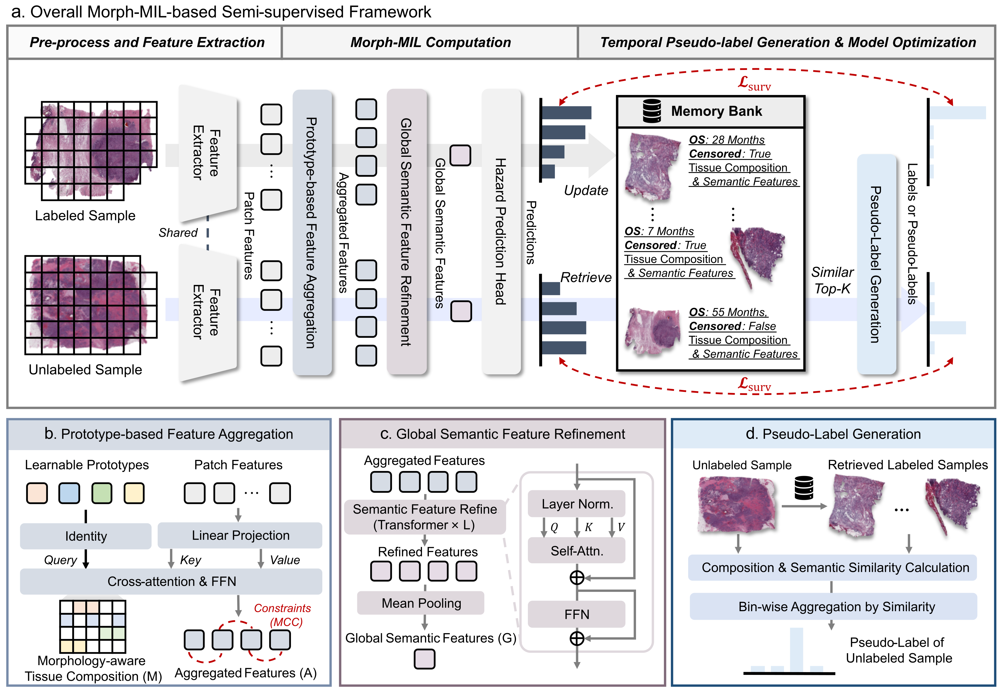
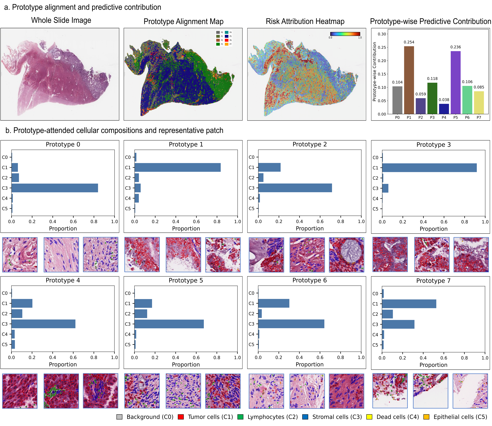

# SSL-Morph-MIL

Code release for our paper:
**Towards Scalable Cancer Prognosis by Aligning Semi-supervised Learning with Survival Modeling.**
This repository provides the code for a semi-supervised multiple instance learning (MIL) framework for whole-slide image (WSI)-based cancer prognosis. The proposed framework integrates Morph-MIL, a dynamic memory bank, and a temporal pseudo-labeling strategy to improve WSI survival modeling under limited survival annotations.

## Overview



The proposed framework contains three main stages:

1. **Pre-processing and Feature Extraction**  
   H&E-stained WSIs are segmented, tiled, and encoded into patch-level features using pretrained pathology foundation models.

2. **Morph-MIL Computation**  
   Morph-MIL aggregates patch-level features through learnable prototypes, models morphology-aware tissue composition, refines global semantic features, and predicts discrete-time survival hazards.

3. **Temporal Pseudo-label Generation and Model Optimization**  
   A dynamic memory bank stores labeled samples' tissue composition and global semantic features. Unlabeled samples are matched with labeled samples in the memory bank, and temporally related discrete pseudo-labels are generated through bin-wise aggregation according to multi-level similarities.

## Highlights

- Systematic analysis of the limitations of existing SSL methods for WSI prognosis.
- The first semi-supervised MIL framework for WSI prognosis is proposed.
- Morph-MIL jointly models tissue composition and global semantic features.
- Temporally related discrete pseudo-labels generated by bin-wise aggregation.
- Experiments on five cancers verify performance, generalization, and interpretability.

## Dataset

This project uses TCGA cohorts as labeled data and CPTAC cohorts as annotation-free data.

### TCGA

TCGA WSIs and clinical information can be downloaded from the GDC Data Portal:

- https://portal.gdc.cancer.gov/

Example cohorts used in this study:

- TCGA-UCEC
- TCGA-LUAD
- TCGA-CRC
- TCGA-KIRC
- TCGA-BRCA

### CPTAC

CPTAC pathology images can be downloaded from the official CPTAC/TCIA collections:

- https://www.cancerimagingarchive.net/

Please download the corresponding CPTAC cohorts and organize them consistently with the TCGA data.

---

## WSI Pre-processing

We recommend using  [**Trident**](https://github.com/mahmoodlab/TRIDENT) to preprocess H&E WSIs and extract patch-level features.

The typical pre-processing pipeline is:

1. Tissue segmentation.
2. Patch extraction from WSIs.
3. Patch-level feature extraction using pretrained encoders, such as UNI or CONCH.
4. Save extracted WSI features as `.pt` files.

Expected feature directory:

```text
tcga_features/
└── pt_files/
    ├── TCGA_case_001.pt
    └── ...

cptac_features/
└── pt_files/
    ├── CPTAC_case_001.pt
    └── ...
```
Clinical label file
A CSV file containing survival labels and censoring information:
```
/path/to/labels/
└── clinical_labels.csv
```

## Installation
Once you clone the repo, please run the following command to create a conda environment:
```
conda env create -f morphmil_env.yaml
```

## Model training and testing
### Fully supervised
Run Morph-MIL using only labeled TCGA data:
```
python main_ucec.py \
    --semi_sup False \
    --data_dir /path/to/tcga_features \
    --label_file /path/to/clinical_labels.csv
```    
### Semi-supervised
Run the proposed semi-supervised framework using labeled TCGA data and unlabeled CPTAC data:
```
python main_ucec.py \
    --semi_sup True \
    --data_dir /path/to/tcga_features \
    --add_data_dir /path/to/cptac_features \
    --label_file /path/to/clinical_labels.csv
```
## Evaluation
The main evaluation metric is the concordance index (C-index). Detailed experimental settings, quantitative results, ablation studies, and visualization analyses are provided in our paper.

##  Visualization




## Citation
If you find this repository useful, please cite our paper:
```
@article{huang2026scalable,
  title={Towards Scalable Cancer Prognosis by Aligning Semi-supervised Learning with Survival Modeling},
  author={Huang, Yi and Cai, Linghan and Feng, Ziliang and Zhao, Mengjie and Tu, Xiaoguang and Yuan, Zhiyuan and Wang, Zhikang},
  journal={xxx},
  year={2026}
}
```
## Acknowledgement
We thank the maintainers of TCGA, CPTAC, TRIDENT, UNI, CONCH, and related open-source computational pathology resources.


